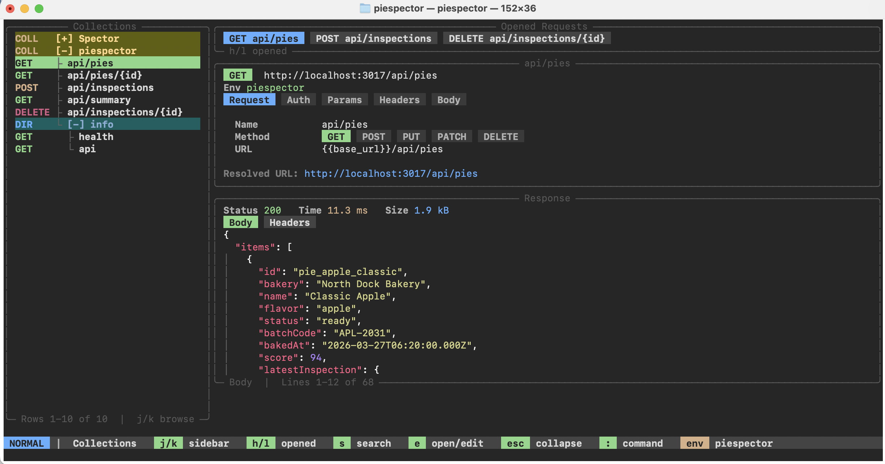

# piespector

`piespector` is a terminal-first API client.

Organize HTTP requests into collections and folders, manage named env sets, replay history, and work from a keyboard-driven TUI.

## Installation

[Install from source](https://www.piespector.com/getting-started/installation/#install-from-source).

## Documentation

[piespector.com](https://www.piespector.com)
